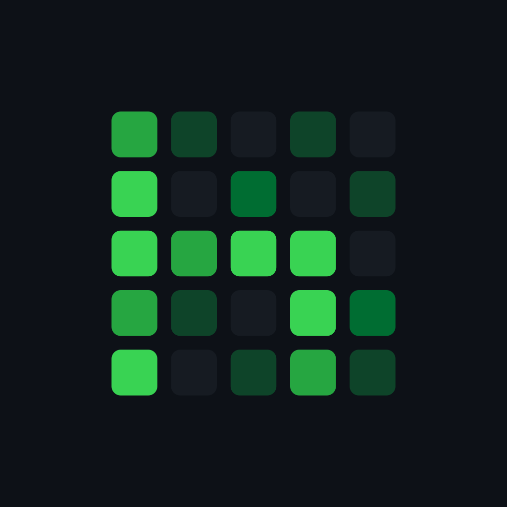
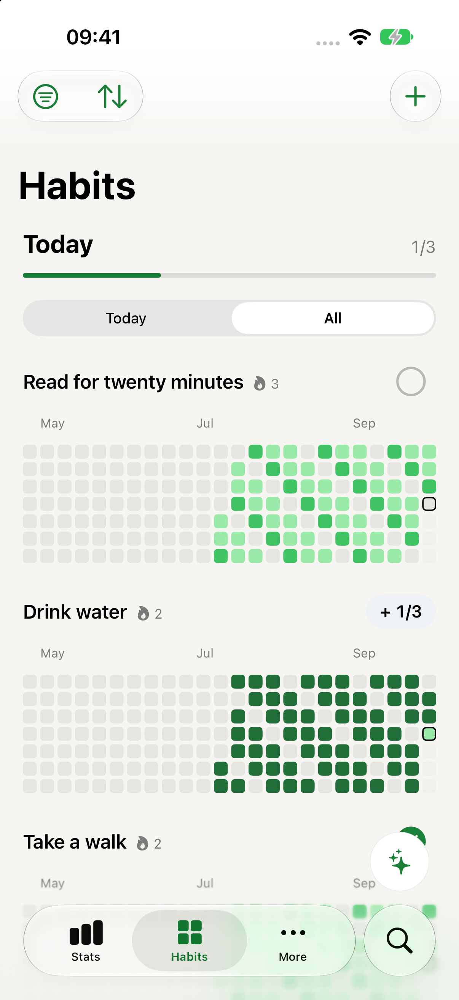
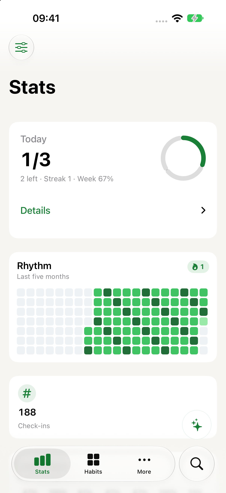
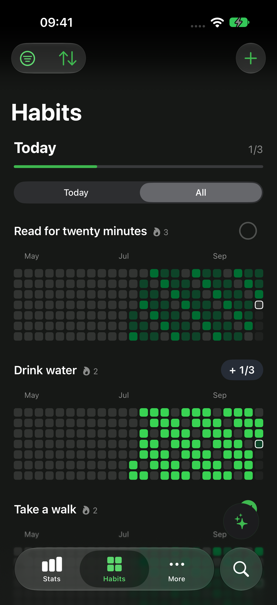

<h1 align="center">hAiity</h1>

<strong>Small habits. A bigger picture.</strong> A native iPhone habit tracker where every habit is a contribution graph.

<a href="https://enrzh.github.io/hAiity/">Explore the app</a> · <a href="https://enrzh.github.io/hAiity/en/privacy.html">Privacy</a> · <a href="mailto:getaiityapp+hAiity@gmail.com?subject=hAiity%20beta">Ask about the beta</a>

  
  
  

## Check in. Paint a square.

Read a little, take a walk, make time for what matters. Each check-in fills a
cell in your habit's contribution graph. Small actions become a visible
pattern over time.

- **Your kind of habit:** check-off, quantity, checklist and avoidance habits,
  with reminders alongside them.
- **Your schedule:** weekdays, intervals and rules within a month. Days that
  aren't due don't break a streak. Backfill a past day when you need to.
- **Today and the bigger picture:** a progress summary, contribution graphs,
  streaks and full statistics with Pro.
- **At home on iPhone:** widgets, Siri, Control Center, color palettes, app
  icons, light/dark appearances, Dynamic Type, VoiceOver and Reduce Motion.
- **17 interface languages**, including German and English.

## Your routine belongs to you

Habits live locally on your iPhone. When the device is signed into iCloud,
hAiity mirrors them into **your own private CloudKit database**. Offline
tracking remains available.

No hAiity account, analytics, advertising or developer-operated sync server.
Check-ins merge rather than replace one another. JSON export and import give
you another way to keep your data; imports merge instead of overwriting it.
Optional Apple Reminders and read-only GitHub integrations are yours to enable.

[English privacy policy](https://enrzh.github.io/hAiity/en/privacy.html) ·
[Datenschutzerklärung](https://enrzh.github.io/hAiity/privacy.html)

## Free and Pro

Free includes up to **three active habits**, every habit kind, contribution
graphs, streaks, widgets, Siri, reminders, built-in palettes, app icons and JSON
export. Archived habits do not count toward the limit.

hAiity Pro unlocks unlimited habits, custom colors, the calendar mirror and full
statistics. It is designed as a **one-time purchase**, with no subscription.
Purchase availability and regional pricing are shown in the app.

## Availability

In development, tested through TestFlight. **iPhone, iOS 18 or later.**
This repository does not currently offer a public invitation or App Store
download link. [Ask about beta availability](mailto:getaiityapp+hAiity@gmail.com?subject=hAiity%20beta).

These screenshots were freshly captured on **October 7, 2026**, from build 276,
using synthetic habits on a dedicated simulator. They show the current beta;
they do not imply App Store availability.

## About this repository

This is the public website, screenshots and privacy policies. The app
implementation lives in a separate private repository; this is not an
open-source distribution of the application.

GitHub Pages serves plain HTML and CSS from the root of `main`. No framework,
build step, tracking scripts or external fonts. Preview locally with
`python3 -m http.server 8080` and open it using ego-browser.

Keep requirements, availability and free/Pro boundaries aligned with the app.
Preserve the privacy-policy URLs. See [screenshot provenance and capture
instructions](screenshots/README.md) before updating the images.

Part of [aiity](https://aiity.de) · [sAiity for Mac](https://enrzh.github.io/sAiity/)
