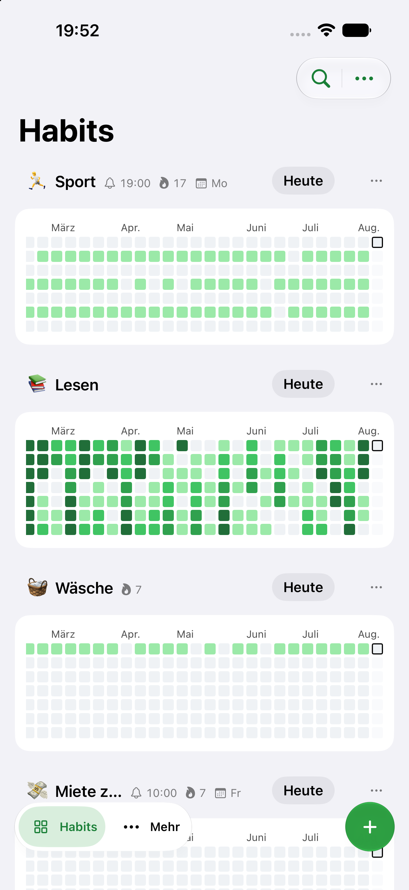
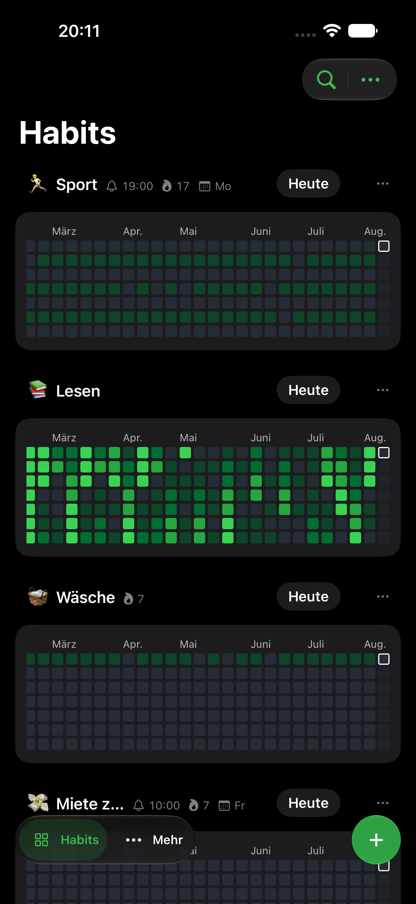
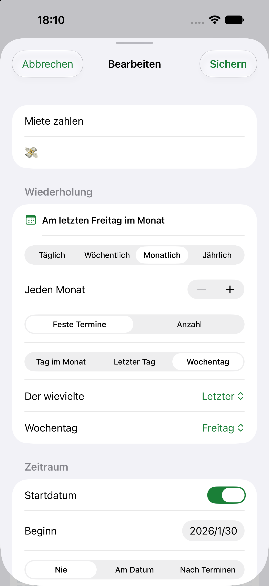
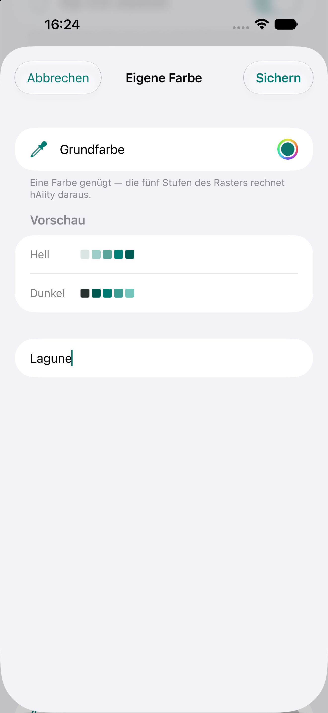
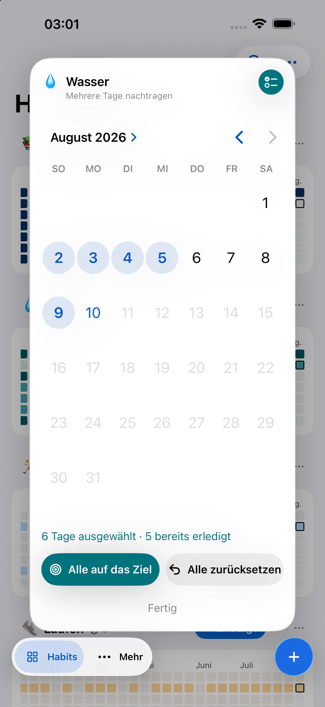
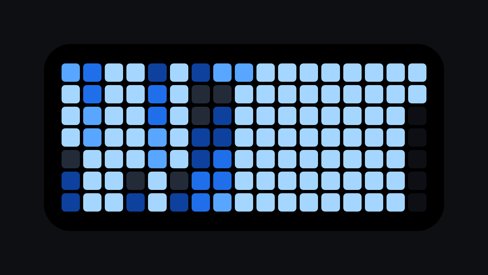

  

<h1 align="center">hAiity</h1>

Habits, GitHub style. A native iOS habit tracker where every habit is a contribution graph.

<a href="https://enrzh.github.io/hAiity/">Website</a> · <a href="https://enrzh.github.io/hAiity/privacy.html">Privacy</a> · <a href="https://aiity.de">Part of the aiity family</a>

---

  
  

## What it is

A habit tracker built around one idea: a year of squares. Check in, paint a cell.
The longer the run, the brighter it gets.

## What it does

**Habits are calendar rules.** Not just daily or weekly — every N days, weeks,
months or years; specific weekdays; the 3rd Tuesday or the last Friday of the
month; start dates and end conditions. Days a habit isn't due are transparent:
they never break a streak.

**Your colours.** Six built-in palettes, or pick any colour and the app computes
the five-step ramp for light and dark itself. Per-habit overrides, and the app
icon follows along.

**Fill in the past.** Forgot Tuesday? Long-press the graph, pick the day — or
several at once — and it's recorded. One undo puts it all back exactly as it was.

**Widgets.** A pure contribution graph, a roster of every habit, Lock Screen
accessories, and a Control Centre button to check off without opening the app.

**16 languages**, German through Korean.

  
  
  

## Where your data lives

On your phone. That's the whole answer.

If you're signed into iCloud it also mirrors to **your own** private iCloud
database, so a second device catches up on its own. There is no hAiity account,
no sign-up, and no server of ours anywhere in the path — because there is no
"we" in the data path to have one.

The sync is built so it can't lose a day: check-ins merge rather than overwrite,
and a conflict resolves by keeping both sides.

  

## Status

In TestFlight, moving toward the App Store. iPhone, iOS 17 and later.

## Source

This repository is the shop window. The app's source lives in a private
repository — if you'd like a look, ask.

---

Built with <a href="https://claude.com/claude-code">Claude Code</a>

